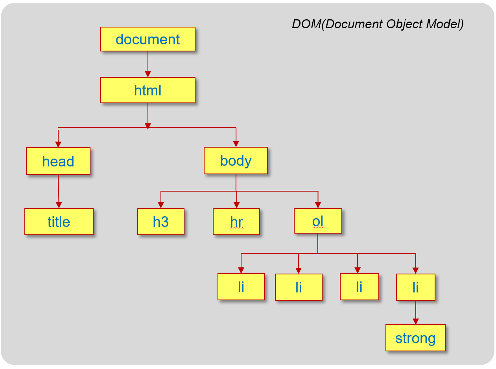

# Chapter 8

---

### 1.다음은 HTML 페이지와 브라우저의 출력 결과이다.

(1)HTML 페이지의 HTML DOM 트리를 그려라.


```html
<!DOCTYPE html>
<html>

<head>
    <meta charset="UTF-8">
    <title>라면을 끓이는 순서</title>
</head>

<body>
    <h3>라면을 끓이는 순서</h3>
    <hr>
    <ol type="A">
        <li>물을 끓인다.</li>
        <li>라면과 스프를 넣는다.</li>
        <li>파를 썰어 넣는다.</li>
        <li>5분 후 <strong>맛있게</strong> 먹는다.</li>
    </ol>
    
</body>

</html>
```

ol 태그의 type을 “A”로하여 리스트를 번호를 A, B, C, D로 출력되게함

그리고 img태그로 dom트리 출력

(2)</ol>와 <body>태그 사이에 다음과 같이 자바스크립트 코드를 작성하여 모든<li>태그를 찾아 글자 색을 green으로 출력하라.


```html
<!DOCTYPE html>
<html>

<head>
    <meta charset="utf-8">
    <title>라면을 끓이는 순서</title>
</head>

<body>
    <h3>라면을 끓이는 순서</h3>
    <hr>
    <ol type="A">
        <li>물을 끓인다.</li>
        <li>라면과 스프를 넣는다.</li>
        <li>파를 썰어 넣는다.</li>
        <li>5분 후 <strong>맛있게</strong> 먹는다.</li>
    </ol>
    <script>
        let liArray = document.getElementsByTagName("li");
        for (let i = 0; i < liArray.length; i++) {
            let obj = liArray[i];
            obj.style.color = 'green';
        }
    </script>
</body>

</html>
```

getElementsByTagName(”li”)를 이용하여 li태그를 찾고 green으로 출력

(3) 리스트가 출력된 공간 아무 곳이나 클릭하면 리스트 전체의 배경색을 yellowgreen으로 바꾸는 자바 크립트 코드를 작성하라.


```html
<!DOCTYPE html>
<html>

<head>
    <meta charset="utf-8">
    <title>라면을 끓이는 순서</title>
</head>

<body>
    <h3>라면을 끓이는 순서</h3>
    <hr>
    <ol type="A" onclick="this.style.backgroundColor='yellowgreen'">
        <li>물을 끓인다.</li>
        <li>라면과 스프를 넣는다.</li>
        <li>파를 썰어 넣는다.</li>
        <li>5분 후 <strong>맛있게</strong> 먹는다.</li>
    </ol>
</body>

</html>
```

onclick리스너를 이용해 클릭시 배경색이 변경되도록함

### 1.다음은 HTML 페이지와 브라우저의 출력 결과이다.

(1)HTML 페이지의 HTML DOM 트리를 그려라.

```html
<!DOCTYPE html>
<html>

<head>
    <title>자바스크립트 연습</title>
</head>

<body>
    <h3>자바스크립트란? <button>border</button>
        <button>p</button>
    </h3>
    <hr>
    <p>자바스크립트는 웹 프로그래밍 언어로서 웹 페이지롤 동적 변경시킬 수 있다. </p>
    <p><span id="mySpan">C 언어 </span>를 아는 사용자는 빠르게 학습할 수 있다.</p>
    <p>이벤트 등 GUI 프로그래밍에 필요한 요소들이 있어 학습에 약간의 어려움이 있다.</p>
</body>

</html>
```


(2) "border" 버튼을 클릭하면 다음과 같이 id="mySpan“ 인 <span> 태그에 2픽셀의 violet 색 점
선 테두리가 생기도록 자바스크립트 코드를 작성하라.

```html
<!DOCTYPE html>
<html>

<head>
    <title>자바스크립트 연습</title>
    <script>
        function bclick() {
            let myspan = document.getElementById("mySpan");
            myspan.style.border = "2px dotted violet";
        }
    </script>
</head>

<body>
    <h3>자바스크립트란? <button onclick="bclick()">border</button>
        <button>p</button>
    </h3>
    <hr>
    <p>자바스크립트는 웹 프로그래밍 언어로서 웹 페이지롤 동적 변경시킬 수 있다. </p>
    <p><span id="mySpan">C 언어 </span>를 아는 사용자는 빠르게 학습할 수 있다.</p>
    <p>이벤트 등 GUI 프로그래밍에 필요한 요소들이 있어 학습에 약간의 어려움이 있다.</p>
</body>

</html>
```


bclick()함수를 만들어 getElementById로 mySpan id찾고 스타일프로퍼티로 꾸밈. button에 onclick리스너를 추가

(3) "p" 버튼을 클릭하면 <p> 태그가 몇 개 있는지 alert( )를 통해 다음과 같이 출력되도록 자바스
크립트 코드를 삽입하여 HTML 페이지를 수정하라.


```html
<!DOCTYPE html>
<html>

<head>
    <title>자바스크립트 연습</title>
    <script>
        function bclick() {
            let myspan = document.getElementById("mySpan");
            myspan.style.border = "2px dotted violet";
        }
        function check() {
            let count = document.getElementsByTagName("p");
            alert("<p> 태그의 개수는 " + count.length);
        }
    </script>
</head>

<body>
    <h3>자바스크립트란? <button onclick="bclick()">border</button>
        <button onclick="check()">p</button>
    </h3>
    <hr>
    <p>자바스크립트는 웹 프로그래밍 언어로서 웹 페이지롤 동적 변경시킬 수 있다. </p>
    <p><span id="mySpan">C 언어 </span>를 아는 사용자는 빠르게 학습할 수 있다.</p>
    <p>이벤트 등 GUI 프로그래밍에 필요한 요소들이 있어 학습에 약간의 어려움이 있다.</p>
</body>

</html>
```

check()라는 함수 생성. getElementsByTagName을 이용해 p태그 찾고length로 개수를 세고 button에 onclick리스너 추가하여 클릭시 개수 출력

### 3.다음은 예제 5-7을 수정하여 출력한 결과이다. 예제에 버튼 (show/hide)을 추가하고 자바 스크립트 코드를 삽입하여 버튼을 클릭하면 답이 보이게 하고, 다시 클릭하면 숨기도록 구현하였다. 웹 페이지를 작성하라.


```html
<!DOCTYPE html>
<html lang="en">

<head>
    <meta charset="UTF-8">
    <meta name="viewport" content="width=device-width, initial-scale=1.0">
    <title>visibility 프로퍼티</title>
    <style>
        span {
            visibility: hidden;
            color: blue;
        }
    </style>
    <script>
        function show() {
            let objArray = document.getElementsByTagName("span");
            for (let i = 0; i < objArray.length; i++) {
                let obj = objArray[i];
                let style = window.getComputedStyle(obj);
                let v = style.getPropertyValue("visibility");
                if (v == "hidden")
                    obj.style.visibility = "visible";
                else
                    obj.style.visibility = "hidden";
            }
        }
    </script>
</head>

<body>
    <h3>다음 빈 곳에 숨은 단어? <button onclick="show()">show/hide</button></h3>
    <hr>
    <ul>
        <li>I (<span>love</span>) you.</li>
        <li>CSS is Cascading (<span>Style</span>) Sheet.</li>
        <li>응답하라 (<span>1998</span>).</li>
    </ul>
</body>

</html>
```

show( ) 함수 생성 getElementsByTagName으로 span태그 찾고 getComputedStyle, getPropertyValue메소드 사용

### 4. 다음과 같이 계산식이 출력되고 ‘답'을 클릭하면 계산 결과를 출력하는 웹 페이지를 작성하고자 한다. HTML 소스의 빈칸을 재우고 HTML 페이지를 완성하라.


```html
<!DOCTYPE html>
<html>

<head>
    <title>계산해봅시다</title>
</head>

<body>
    <h3>계산해봅시다</h3>
    <hr>
    <p>2 + 4 = <span onclick="this.innerHTML=eval(2+4)">답</span></p>
    <p>4 * 20 + 64 = <span onclick="this.innerHTML=eval(4*20+64)">답</span></p>
    <p>20/5-8*2 = <span onclick="this.innerHTML=eval(20/5-8*2)">답</span></p>
</body>

</html>
```

this와 innerHTML을 이용하여 리스너에 코드 씀

### 5. 다음 HTML 페이지를 출력하면 동일한 크기의 카드 4개가 겹쳐 있어, 맨 위에 배치된 카드만 보인다(예제 5-6 참고).  이것은 각 카드 이미지의 z-index 스타일 프로퍼티 값을 다르게 설정하여 값이 클수록 위에 배치되도록 하였기 때문이다. 카드 이미지를 클릭하면 클릭된 카드가 맨 밑으로 들어가고 바로 밑의 카드가 나타나도록, 자바스크립트 코드를 작성하라.


```html
<!DOCTYPE html>
<html>

<head>
    <meta charset="utf-8">
    <title>z-index 스타일 프로퍼티</title>
    <style>
        div {
            position: absolute;
        }

        img {
            position: absolute;
        }
    </style>
</head>

<body>
    <h3>z-index 스타일 프로퍼티</h3>
    <hr>
    <div>
        
        
        
        
    </div>
    <script>
        let imgArray = document.getElementsByTagName("img");
        for (let i = 0; i < imgArray.length; i++) {
            let obj = imgArray[i];
            obj.style.zIndex = i;
            obj.style.left = "10px";
            obj.style.top = "20px";

            obj.onclick = shuffle;
        }
        function shuffle() {
            for (let i = 0; i < imgArray.length; i++) {
                let obj = imgArray[i];
                obj.style.zIndex++;
                obj.style.zIndex %= imgArray.length;
            }
        }
    </script>
</body>

</html>
```

카드 이미지를 클릭하면 클릭된 카드가 맨 밑으로 들어가고 바로 밑의 카드가 나타나도록, 자바스크립트 코드를 작성함

### 6. DOM 객체의 innerHTML 프로퍼티를 다루는 연습을 해보자. 다음과 같이 <p></p> 태그로 출력된 텍스트에 마우스로 클릭하면. prompt() 창을 출력하고 사용자가 입력한 HTML 텍스트로 <p> 태그의내용을 바꾸는 웹 페이지를 작성하라.


```html
<!DOCTYPE html>
<html>

<head>
    <title> innerHTML </title>
    <script>
        function trip() {
            let x = prompt("HTML 텍스트 혹은 그냥 텍스트를 입력하세요.");
            let y = document.getElementById("a");
            y.innerHTML = x;
        }
    </script>
</head>

<body>
    <h3>innerHTML</h3>
    <hr>
    <p id="a" onclick="trip()">이번 여름에는 어디로 여행을 갈까요?</p>
</body>

</html>
```

### 7. 이미지를 마우스로 클릭하면 이미지를 90도 회전시키는 웹 페이지를 작성하라.

(1) 클릭하면 한 번만 90도 회전하기


```html
<!DOCTYPE html>
<html>

<head>
    <meta charset="utf-8">
    <title>transform:rotate()</title>
    <script>
        function rotate(obj) {
            obj.style.transform = "rotate(90deg)";
        }
    </script>
</head>

<body>
    <h3>클릭하면 90도 회전합니다.</h3>
    <hr>
    
</body>

</html>
```

(2) 클릭할 때마다 90도씩 계속 회전하기

)

```html
<!DOCTYPE html>
<html>

<head>
    <meta charset="utf-8">
    <title>transform:rotate()</title>
    <script>
        let n = 90;
        function rotate(obj) {
            obj.style.transform = "rotate(" + n + "deg)";
            n += 90;
            n %= 360;
        }
    </script>
</head>

<body>
    <h3>클릭하면 90도 회전합니다.</h3>
    <hr>
    
</body>

</html>
```

### 8. 이미지를 클릭할 때마다 옆으로 2, 3,4 배로 확대하여 출력하는 웹 페이지를 작성하라.


```html
<!DOCTYPE html>
<html>

<head>
    <title>transform:roatae()</title>
    <script>
        n = 2;
        function scale(obj) {
            obj.style.transform = "scale(" + n + ",1)";
            n++;
        }
    </script>
</head>

<body>
    <h3>클릭하면 2,3,4 배로 옆으로 늘어납니다.</h3>
    <hr>
    
</body>

</html>
```

### 9. yellowgreen 색으로 칠해진 영역은 <ol>이 출력된 영역이다. 이 영역에 마우스로 클릭하면 다음과 같이 prompt() 함수를 출력하고, 사용자로부터 입력받은 문자열로 라면을 끓이는 순서를 하나씩 삽입하는 자바스크립트 코드를 삽입하라.


```html
<!DOCTYPE html>
<html>

<head>
    <meta charset="utf-8">
    <title>라면을 끓이는 순서</title>
    <script>
        function addItem(parent) {
            let text = prompt("라면을 끓이는 순서를 입력하라", "");
            if (text == null || text == "")
                return;

            let liObj = document.createElement("li");
            liObj.innerHTML = text;
            parent.appendChild(liObj);

        }
    </script>
</head>

<body>
    <h3>라면을 끓이는 순서</h3>
    <hr>
    <ol type="A" style="background-color:yellowgreen" onclick="addItem(this)">
        <li>물을 끓인다.</li>
    </ol>
</body>

</html>
```

innerHTML과 appendChild를 이용해서 출력

### 10. 다음 오른쪽 위 화면에서 답보기 버튼을 누르면 아래 화면과 같이 정답이 출력된다.

(1) 정답은 다음 코드에서 <p> 객체를 동적으로 생성하여 삽입한다. 코드를 완성하라

```html
<!DOCTYPE html>
<html>

<head>
    <title>DOM 객체 동적 삽입</title>
    <script>
        function addAnswer(obj, text) {
            let x = document.createElement("p");
            x.innerHTML = text;
            obj.parentElement.appendChild(x);
            x.setAttribute("id", "click");
        }
    </script>
</head>

<body>
    <h3>정답의 동적 삽입</h3>
    <hr>
    <div>
        <p> Q. 거울아 거울아 세상에서 누가 제일 예쁘니?</p>
        <button onclick="addAnswer(this, '백설공주')">답보기</button>
    </div>
    <div>
        <p> Q. 죽느냐 사느냐 어떤 것이 문제인가?</p>
        <button onclick="addAnswer(this, '둘다')">답보기</button>
    </div>
</body>

</html>
```

(2) 문제 (1)의 코드를 수정하여 정답으로 출력된 ‘백설 공주’나 ‘둘다’를 클릭하면 정답이 다시 제거되게 하라.


```html
<!DOCTYPE html>
<html>

<head>
    <title>DOM 객체 동적 삽입</title>
    <script>
        function addAnswer(obj, text) {
            let x = document.createElement("p");
            x.innerHTML = text;
            obj.parentElement.appendChild(x);
            x.setAttribute("id", "click");
            x.addEventListener("click",
                function () {
                    let y = this.parentElement;
                    y.removeChild(this);
                });
        }
    </script>
</head>

<body>
    <h3>정답의 동적 삽입</h3>
    <hr>
    <div>
        <p> Q. 거울아 거울아 세상에서 누가 제일 예쁘니?</p>
        <button onclick="addAnswer(this, '백설공주')">답보기</button>
    </div>
    <div>
        <p> Q. 죽느냐 사느냐 어떤 것이 문제인가?</p>
        <button onclick="addAnswer(this, '둘다')">답보기</button>
    </div>
</body>

</html>
```
